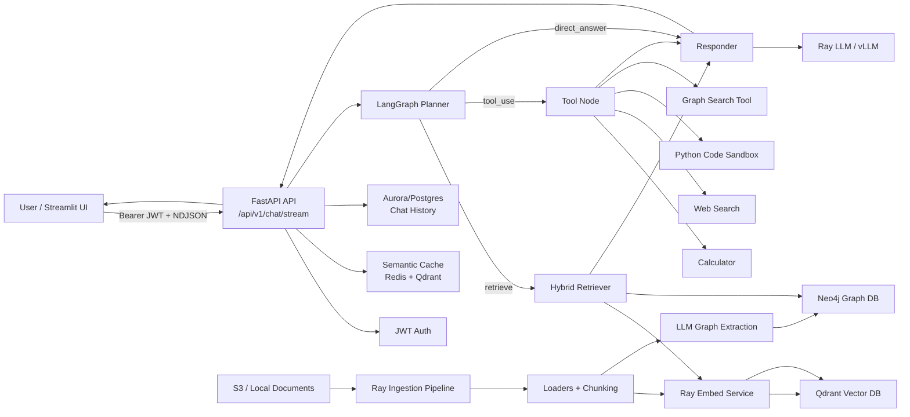

# Current Architecture Diagram

This Mermaid diagram reflects the implementation in this repository more
closely than the image. It includes the currently implemented tools and omits
components that are not present in code, such as a text-to-SQL generator.

## Summary

The deployed shape in the image is directionally right: this is an AWS/EKS RAG
platform with Terraform/Helm deployment, FastAPI ingress, JWT auth, semantic
cache, LangGraph planning, vector search with Qdrant, graph search with Neo4j,
Ray-hosted embedding and LLM services, ingestion from S3/documents, and
Prometheus/Grafana-style observability assets.

The main refinements from the code are:

- The user-facing API is specifically `POST /api/v1/chat/stream`, which streams
  newline-delimited JSON events.
- The planner routes to one of three paths: direct answer, retrieval, or tool
  use.
- Implemented tools are calculator, web search, sandboxed Python execution, and
  graph search.
- Hybrid retrieval embeds the query, then runs Qdrant vector search and Neo4j
  graph search concurrently before handing context to the responder.
- Chat memory is stored in Postgres/Aurora by `session_id`.
- A text-to-SQL generator is not currently implemented, and there is no code path
  that converts natural language to SQL against the RDBMS.

## Logic Flow

- **User / Streamlit UI** starts or continues a chat session. The UI sends the
  user's message, the current `session_id`, and a Bearer JWT to the streaming
  chat endpoint.
- **FastAPI API** receives `POST /api/v1/chat/stream`, validates the request,
  creates a session ID when needed, streams NDJSON events back to the client,
  and coordinates cache, memory, and LangGraph execution.
- **JWT Auth** validates the Bearer token and extracts the user context used by
  the chat route.
- **Semantic Cache** checks whether a semantically similar question has already
  been answered. It uses Redis/Qdrant-backed cache state; on a hit, the API can
  stream the cached answer without running the full agent graph.
- **Aurora/Postgres Chat History** stores user and assistant messages by
  `session_id`. Before agent execution, the API loads recent turns to provide
  conversation context.
- **LangGraph Planner** classifies the latest user query into one of three
  paths: `direct_answer`, `retrieve`, or `tool_use`. It calls the LLM for this
  routing decision.
- **Hybrid Retriever** runs when the planner selects `retrieve`. It embeds the
  refined query, searches Qdrant for semantically similar chunks, searches Neo4j
  for graph relationships, merges the results, and passes context to the
  responder.
- **Ray Embed Service** creates embeddings for online user queries and ingestion
  chunks. Query embeddings feed Qdrant search; document embeddings are indexed
  into Qdrant.
- **Qdrant Vector DB** stores document vectors and participates in semantic
  cache lookup. It is read during retrieval and written during ingestion.
- **Neo4j Graph DB** stores extracted entities and relationships. The retriever
  queries it directly during hybrid retrieval; the graph search tool can also
  query it when selected by the planner.
- **Tool Node** runs only when the planner selects `tool_use`. It dispatches the
  query to one specific registered tool, then passes the tool result to the
  responder.
- **Calculator, Web Search, Python Code Sandbox, Graph Search Tool** are the
  currently registered tools. The graph search tool is separate from normal
  retrieval: it uses the LLM to extract entities and then performs a safe,
  parameterized Neo4j neighborhood lookup.
- **Responder** synthesizes the final assistant answer. For retrieval, it uses
  retrieved context; for tool use, it uses tool output; for direct answers, it
  responds without retrieval. It calls the LLM for final generation.
- **Ray LLM / vLLM** is used by multiple blocks: planner routing, responder
  generation, graph-search-tool entity extraction, and ingestion-time graph
  extraction.
- **S3 / Local Documents** provide source files for ingestion.
- **Ray Ingestion Pipeline** loads documents asynchronously, chunks them,
  computes embeddings, extracts graph structures, and writes indexes to Qdrant
  and Neo4j. This is separate from the online chat request path.
- **LLM Graph Extraction** happens during ingestion, not during normal online
  retrieval. Its output becomes Neo4j graph data used later by retrieval and the
  graph search tool.
